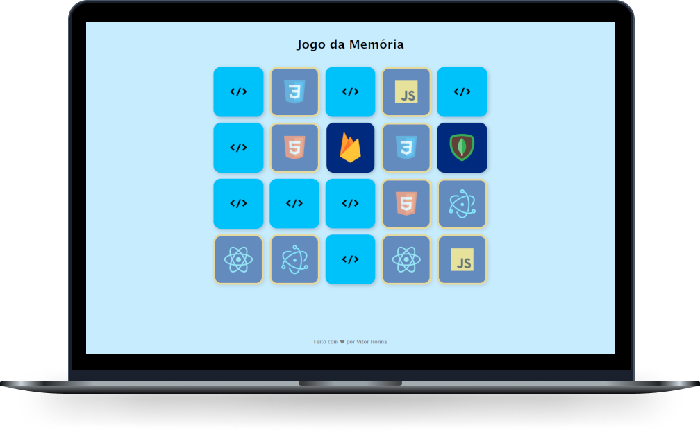

# Jogo da Memória

 

  
   
  Projeto de um jogo da memória com animações.   
  Desenvolvido durante o curso do Programador BR.
    
  
  [Clique aqui](https://vitorhonna.github.io/jogo-da-memoria/) para ver o projeto pronto e funcionando 🥰
  

## 🚀 Tecnologias

 
  
  
  

## 📑 Licença

MIT. [Clique aqui](LICENSE) para mais detalhes.
